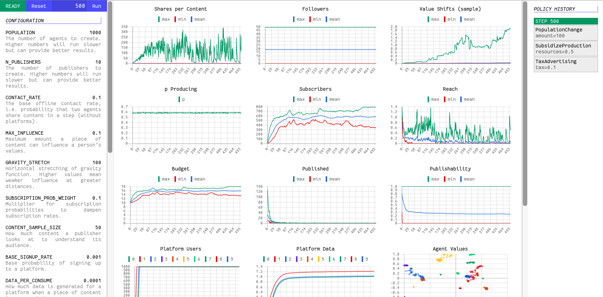

1. Adjust config: `config.yaml`
2. Run simulation: `cargo run` (or `cargo run --release`)
3. Generate plots: `python plot.py`
4. View plots: `runs/latest/plots/index.html`

To run in interactive mode:
1. `COMMAND=1 cargo run`
2. `redis-server`
3. `cd command; python app.py`
4. Visit `http://localhost:8000/`

To implement a new policy option:
1. Add it to the `Policy` enum in `src/model/policy.rs`
2. Implement its effect in `src/model/policy.rs#Simulation.apply_policy`
3. Add its spec to `command/static/command.js#POLICY_SPEC`

---

Search for `ENH` comments for possible enhancements.

---

Run tests with `cargo test -- --nocapture`

---

